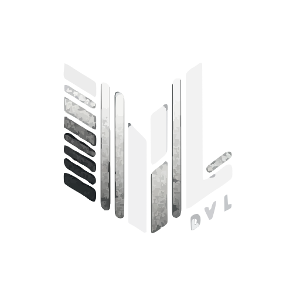

<p align="center">

</p>

<div style="display: flex;"><h3>languages and tools:</h3>
  
  
  
  
  
  
  
  
</div>

# Resume 322

To help new students create a better environment for making Resume
- Alternative web apps other than Google Docs and others
- A place where students can experiment a little with Markdown and CSS
- A tool where the user can convert their typed Markdown and CSS Resume into a working webpage


## Description

Resume 322 is a resume builder, a web application that uses Markdown and CSS to create a resume. Users can export their finished resumes in PDF. Resume 322 is important because of how much of a struggle it is to format a resume through a normal word processor. The ability to be familiar with Markdown is better as it gives users more control.

## Getting Started

### Dependencies

* Describe any prerequisites, libraries, OS version, etc., needed before installing the program.
* ex. Windows 10
* ex. Install Node.js

### Installing

1. Clone the repo
   ```sh
   git clone https://github.com/UCR-Senior-Design/course-project-dvl.git
   ```
2. Go to front end
   ```sh
   cd .\client
   ```
3. Install NPM packages
   ```sh
   npm install
   ```
4. Go to backend
   ```sh
   cd .\server
   ```
5. Install NPM packages
   ```sh
   npm install
   ```

### Executing program

1. Go to client folder
```sh
cd .\client
```
2. Run NPM start
```sh
npm start
```
3. Go to server folder
```sh
cd .\server
```
4. Run NPM run dev
```sh
npm run dev
```
## Help

Any advice for common problems or issues.
```
command to run if program contains helper info
```

## Authors

Dennis Santoso  
Chaiwat Wongsatjachock  
Lester Lien

## Version History

* 0.1
    * Initial Release

## License

This project is licensed under the DVL License - see the LICENSE.md file for details

## Acknowledgments

Inspiration, code snippets, etc.
